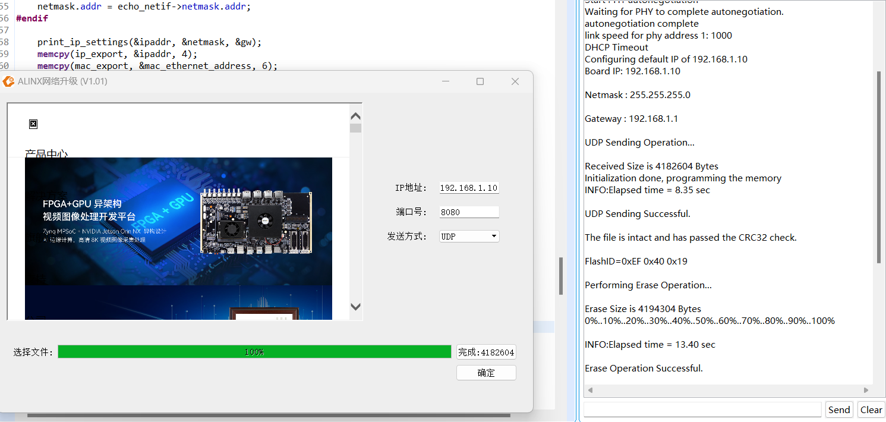

# ZYNQ_RemoteUpdateSystem
本项目成功实现了 FPGA 设备通过网口进行远程固化升级的功能。基于 ALINX 为 ZYNQ 系列提供的固件固化例程进行了二次开发，不仅完成了远程升级的核心功能，还在测试中验证了其稳定性。为了进一步提升数据的安全性和升级过程的可靠性，在固件写入 Flash 之前增加了 CRC 校验，并在项目中集成了对各部分固件升级耗时的测试。

此外，确保了升级过程的完整性，通过在 PC 端和 ZYNQ 处理器系统（PS）端实现 CRC 校验，增强了固件升级的准确性。为了直观展示固件升级的效果，项目设计了一个测试示例：通过升级后的固件控制两个 LED 交替闪烁。这一示例不仅证明了固件升级流程的正确性，也为用户验证升级结果提供了一个简单明了的方法。

# 开发平台

黑金AX7020开发板 + Vivado/Vitis 2021.2

# 实现功能

（1）PC计算固化BIN文件的CRC校验码；

（2）采用ALINX提供的网口上位机完成网口连接和发送BIN文件；

（3）ZYNQ的PS端实现网口接收，接收完成进行CRC校验，校验无误待写入flash；

（4）写入flash，重新上电完成程序自动更新；

（5）计算每个步骤耗时。

# 测试结果

（1）生成CRC校验码

上位机端导入生成好的测试固化程序，执行将BIN文件末尾添加CRC校验码，通过查表法实现CRC32。执行后生成的结果为BOOT_CRC.BIN：

（2）网口在线升级结果测试

网口连接并发送BIN文件，结果显示PS端完成了网口接收，CRC32校验完成，下一步进行flash的写入操作。写入包括：擦除flash、以页为单位写入、读出逐一比对。

在线升级完成后重新上电，LED交替闪烁已被固化完成。

（3）每个步骤的耗时

固化程序大小为4MB，在此情况下对在线升级中各部分的耗时测算如下：LWIP接收数据包（8.35s）+ 擦除flash（13.40s）+ 写入flash（8.05s）+ 写flash检验（1.60s）= 31.40s。
